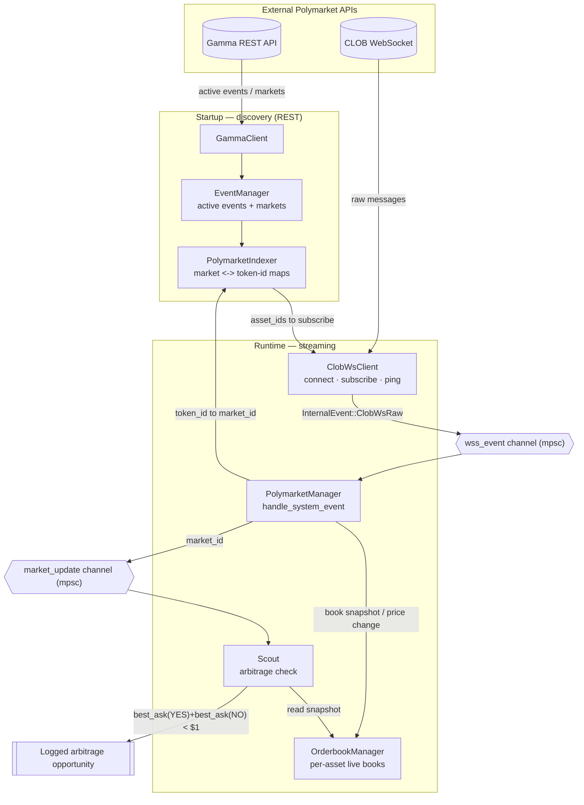
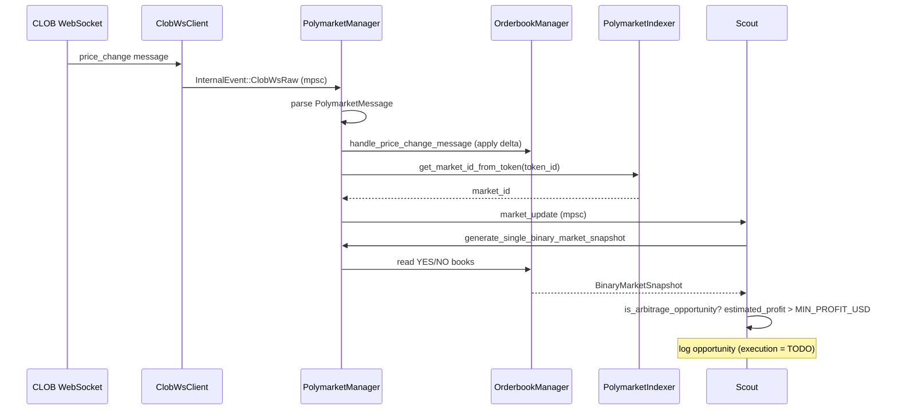

# prediction_market

An asynchronous, event-driven scanner that watches [Polymarket](https://polymarket.com)
binary (YES/NO) markets in real time and flags **arbitrage opportunities** — cases
where the best ask of the YES outcome plus the best ask of the NO outcome sum to
less than `$1.00`, which guarantees a risk-free payoff at resolution.

> **Status: work in progress / archived integration.** This was built against the
> Polymarket Gamma REST and CLOB WebSocket APIs as they existed in late 2025.
> Those endpoints have since changed, so the **live integration no longer runs
> end-to-end against the current Polymarket API** without updating the request
> shapes and message formats. The architecture, the in-memory orderbook and the
> arbitrage logic remain valid and are exercised by the offline unit tests.
> Order *execution* was never implemented — the scout detects and logs
> opportunities but does not place trades. See [Roadmap](#roadmap).

This repository is primarily a portfolio piece: the focus is on a clean,
concurrent Rust architecture rather than on a production trading edge.

## How it works

Polymarket exposes two relevant surfaces:

- the **Gamma REST API** for discovering events and markets, and
- the **CLOB WebSocket** for streaming live orderbook snapshots and price changes.

The system discovers the relevant markets over REST, subscribes to their
orderbooks over WebSocket, keeps an in-memory orderbook per asset, and — on every
price change — re-evaluates the affected market for arbitrage.



On every price change, the hot path is:



### Arbitrage logic

For a binary market with outcomes YES and NO, buying one share of each costs
`best_ask(YES) + best_ask(NO)` and pays out exactly `$1` at resolution. So:

- **Opportunity** when `best_ask(YES) + best_ask(NO) < 1.0`
- **Volume** is bounded by the smaller of the two best-ask sizes
- **Estimated profit** is `volume * (1.0 - best_ask_sum)`

This is implemented in [`BinaryMarketSnapshot`](exchanges/polymarket/src/binary_market/snapshot.rs)
and covered by unit tests.

## Workspace layout

```
prediction_market/
├── main/                      # binary: wires everything together, runs the bot
├── strategy/                  # the Scout: consumes updates, evaluates arbitrage
└── exchanges/
    └── polymarket/            # Polymarket integration (library crate)
        ├── gamma/             # Gamma REST client (event/market discovery)
        ├── clob/              # CLOB WebSocket client + message types
        ├── orderbook/         # in-memory orderbook + fixed-point price/size
        ├── event/ market/ serie/   # domain models
        ├── indexer.rs         # market <-> token-id indexes
        └── manager.rs         # orchestrates REST + WS + indexing
```

Design notes worth highlighting:

- **Fixed-point prices/sizes.** Orderbook levels are keyed by `u32` fixed-point
  integers (6 decimals) in a `BTreeMap`, so the best bid/ask is an O(log n) lookup
  and best levels are cached on every update.
- **Lock-free hot path.** The scout reads orderbook snapshots without holding
  locks across `await` points, and event processing is spawned per-message so the
  WebSocket consumer never blocks.
- **Clear separation.** Discovery (REST), streaming (WS), state (orderbooks/index),
  and strategy (scout) are independent and communicate over `mpsc` channels.

## Build & run

Requires a recent Rust toolchain (edition 2024).

```bash
# Build the whole workspace
cargo build

# Run the scanner (Ctrl+C to stop)
cargo run -p main

# Control log verbosity
RUST_LOG=info cargo run -p main
```

No credentials are required to run the scanner: it only consumes public market
data and does not place orders.

> Note: because the upstream Polymarket APIs have changed since this was written,
> a live run will likely fail to fetch or parse data until the REST/WS request and
> message formats are updated. The offline `cargo test` suite is unaffected.

## Tests

```bash
# Fast, deterministic unit tests
cargo test

# Also run the live integration tests (require network access to Polymarket)
cargo test -- --ignored
```

Unit tests cover the arbitrage math, the fixed-point conversions, orderbook
construction and delta application, market activity/parsing rules, and event
filtering. Tests that hit the live Gamma/CLOB endpoints are marked `#[ignore]` so
the default `cargo test` stays deterministic and offline.

## Roadmap

- [ ] Order execution (signing + CLOB order placement) behind the existing scout
- [ ] Fees and slippage in the profit model
- [ ] Orderbook desync handling (resnapshot on hash mismatch)
- [ ] Multi-series / multi-market coverage beyond BTC 15m up/down
- [ ] Metrics and structured opportunity output

## Tech stack

Rust · Tokio · Tokio-Tungstenite (WebSocket) · Reqwest (HTTP) · Serde · Rayon ·
Tracing · Alloy (EVM types).

## Disclaimer

This is experimental software for educational and research purposes. It is not
financial advice and comes with no warranty. Trading prediction markets carries
risk; use at your own discretion.

## License

Licensed under the [MIT License](LICENSE).
